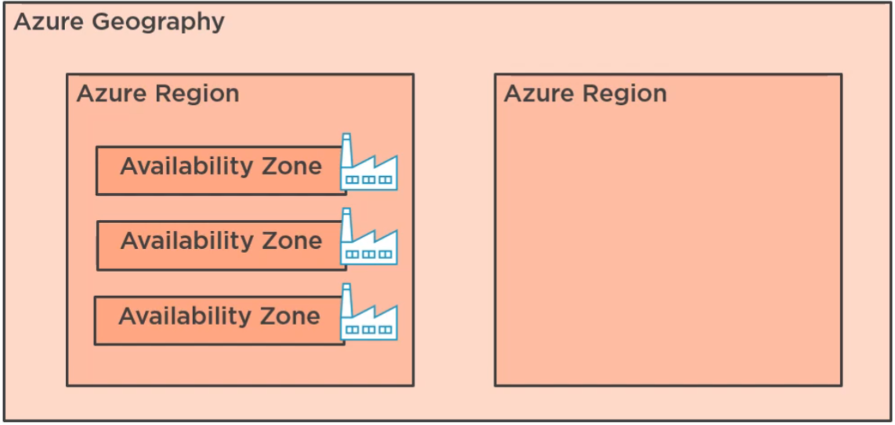

# Locations

There are four concepts to understand:

1. Regions
2. Geographies
3. Availability Zones
4. Region Pairings

## Regions

An Azure region is one or more data centers within a defined latency perimeter.

## Geographies

A geography is a set of regions within a single market, E.G. Europe, America, and the United Kingdom. A geography may span several countries but all countries must be within the same data residency and compliance boundaries.

## Availability Zones

A single region is made up of one or more data centers. When a region has multiple physically separate data centers (min of 3), each becomes an availability zone with it's own power supply, cooling and networking. This provides high availability to applications and data within the region, as it eliminates any single point of failure.

Some services are automatially "zone redundant". For example storage which will automatically replicate across each availability zone within the region, however, other services such as virtual machines aren't zone redundant, instead you need to build multiple virtual machines across each zone and then load balance.

## Region Pairings

Within a single geography there may be many regions, for example the UK has UK South (London) and UK West (Cardiff). When regions are paired Microsoft will ensure that planned maintenance only happens across one of the regions at a time, and in the event of an outage within the geography, they prioritise recovery for one of the regions in the pair. Where possible, paired regions are separated at least 300 miles apart to minimise the chances of disasters affecting both regions.
Some services allow you to configure automatic failover / replication between regions within a region pairing. E.G. Geo-replicated storage.
